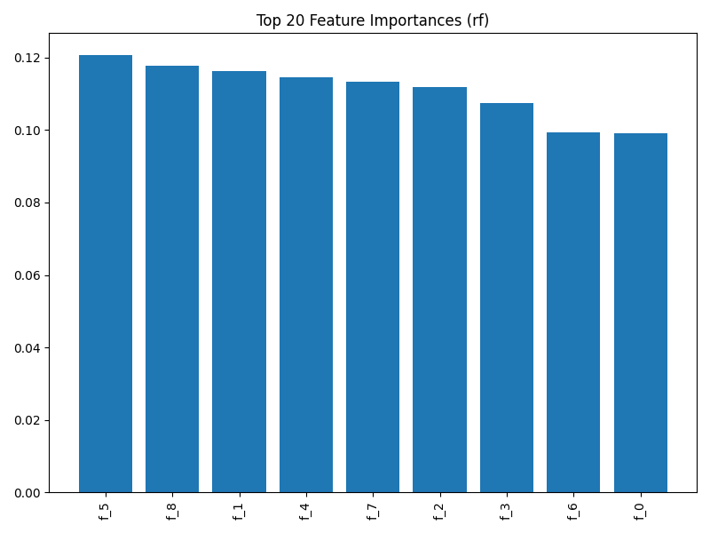
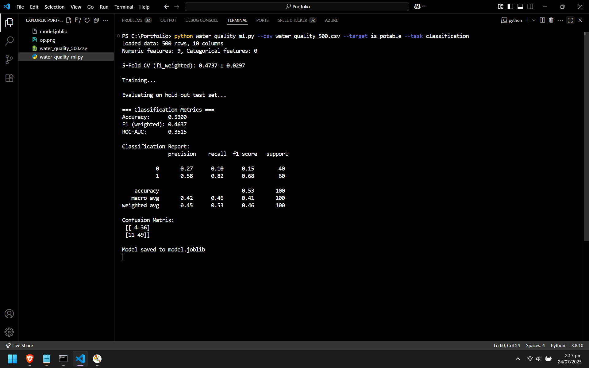

# 🌊 AquaSense: Water Quality Prediction using Machine Learning

> A smart ML-based system to predict water potability based on chemical properties — trained on real-world environmental data. Built with scikit-learn, pandas, and Matplotlib.

---

## 📊 Overview

This project uses machine learning to classify whether a given water sample is **safe for drinking** (potable) or **unsafe** based on various chemical and physical features.

🔍 **Target**: `is_potable`  
🧠 **Model**: Random Forest Classifier  
📁 **Input Format**: CSV file with water quality features  
📈 **Output**: Trained model, evaluation report, and feature importance plot

---

## 🧪 Features Used

| Feature          | Description                              |
|------------------|------------------------------------------|
| `ph`             | pH level of water                        |
| `Hardness`       | Amount of calcium and magnesium          |
| `Solids`         | Dissolved solids in ppm                  |
| `Chloramines`    | Chlorine compounds for disinfection      |
| `Sulfate`        | Sulfate content in mg/L                  |
| `Conductivity`   | Electrical conductivity of water         |
| `Organic_carbon` | Organic carbon content                   |
| `Trihalomethanes`| Toxic by-products of chlorine disinfection |
| `Turbidity`      | Cloudiness of water                      |
| `is_potable`     | ✅ `1`: Safe | ❌ `0`: Unsafe             |

---

## ⚙️ How to Run

### 1. 🔧 Install Requirements
pip install scikit-learn pandas numpy matplotlib

### 2. 🔧 Run the Project
python water_quality_ml.py --csv water_quality_500.csv --target is_potable --task classification

## 📸 Output Preview

